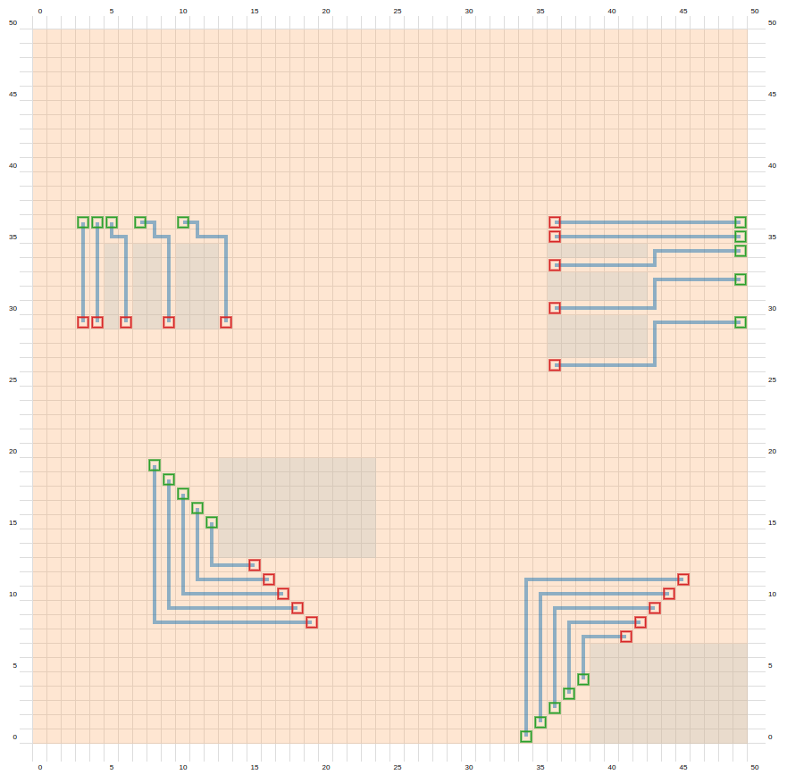

# VLSI-Placer-Router
Source Code for simple VLSI Quadratic Placer and Router.

## Description
- This repository contains the source code for both modules.
- To reference the VLSI Quadratic Placer, navigate to `placer/placer.py`
- To reference the VLSI Router, navigate to `router/router.py`

# VLSI Quadratic Placer
- This python module `QuadraticPlacer` implements a quadratic placer algorithm in 3 parts:
    - Placement of initial gates layout
    - Assignment of logic gates to left and right cutline
    - Containment of logic gates to solve left and right QP layouts 

## Usage
- Benchmarks for this module are run using a bash script `./run_placer.sh`
- Generated output files can be viewed using `https://spark-public.s3.amazonaws.com/vlsicad/javascript_tools/visualize.html` 

# VLSI Router
- This python module `MazeRouter` implements a router that supports the following:
    - 2-point nets
    - Non-unit cost
    - Bend pennalty
    - 2-layers w/ vias.

## Usage
- Benchmarks for this module are run using a bash script `./run_router.sh`
- Generated output files can be viewed using `https://spark-public.s3.amazonaws.com/vlsicad/javascript_tools/router.html` 

